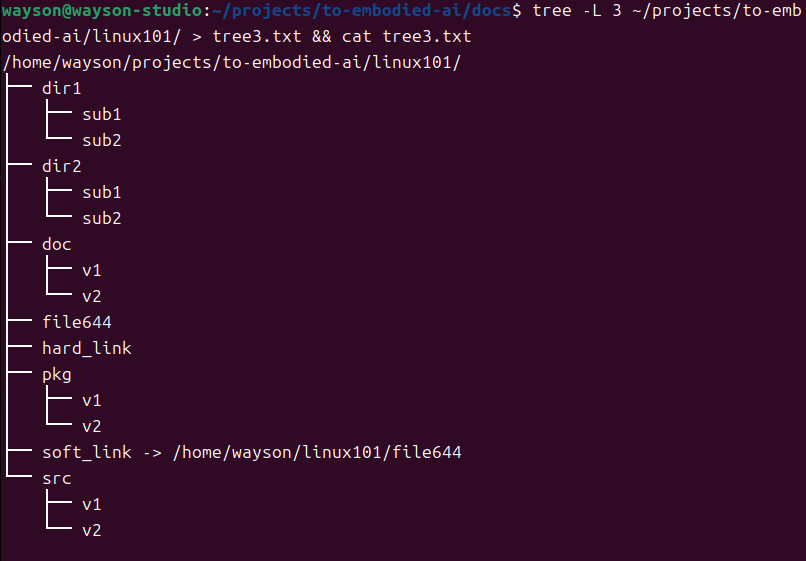
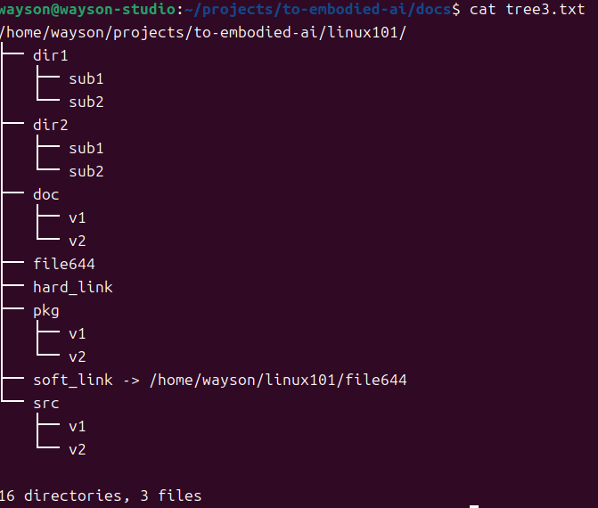
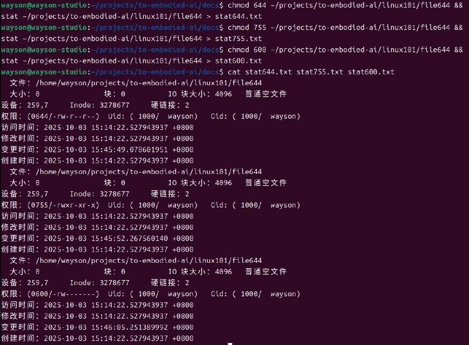
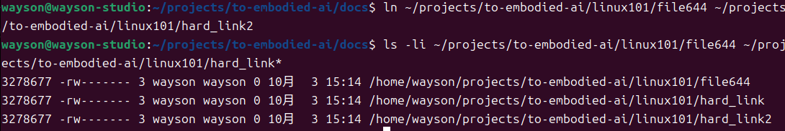
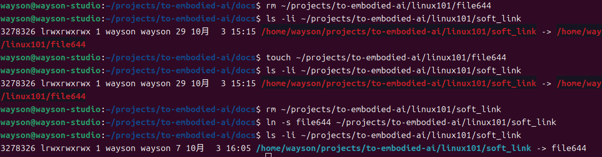
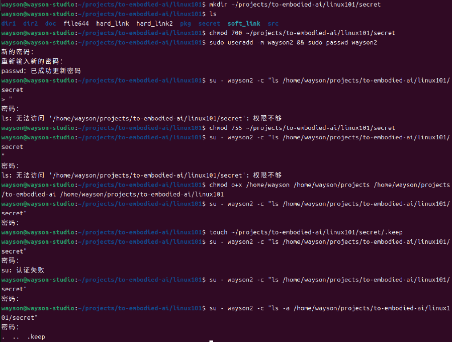
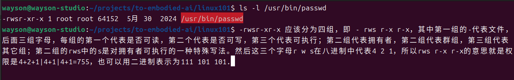

-rwsr-xr-x 应该分为四组，即 - rws r-x r-x，其中第一组的-代表文件，后面三组字母，每组的第一个代表是否可读，第二个代表是否可写，第三个代表可执行；第二组代表拥有者，第二组代表群组，第三组代表 其它组；第二组的rws中的s是对拥有者可执行的一种特殊写法。然后这三个字母r w s在八进制中代表4 2 1，所以rws r-x r-x的意思就是权限是4+2+1|4+1|4+1=755，也可以用二进制表示为111 101 101.

目录树深化，模拟SDK三级目录

把权限先改为644(rw-r--r--，量产脚本默认权限，Owner读写，组/其他只读），再改为755（rwsr-xr-x，可执行文件要求，ASIL-B审计必查x位）,最后改为600（rw-------，密钥/证书最小权限，符合ISO27001控制点）,形成【同文件、三权限、三时间点】证据链。

硬链接计数深化，首先输入ln ~/linux101/file644 ~/linux101/hard_link2，表示空间不翻倍，inode计数+1；量产升级包常用硬链接省Flash。ls -li ~/linux101/file644 ~/linux101/hard_link*是为了肉眼可见inode号相同、链接数=3。这是车归级ECU双备份可执行文件，用硬链接代替复制，节省50%可哦关键。

软链接断链与恢复，先rm删除软链目标，模拟升级包被误删场景，然后touch做目标重建，链接自动恢复，验证【可维护性】。当ROS/Autoware库版本切换的时候，只需要改软链指向，而无需改代码；断链表示【升级失败可以快速回滚】。

目录权限，700=只有拥有者可读写执行，符合【密钥/证书目录】最小权限原则，并且新建了用户来测试权限，然后再改755,其他用户可以ls了，形成700拒绝vs755允许的对比证据。
功能安全符合审核要求【证明敏感目录已限制访问】。

特殊位，-rwsr-xr-x中的s是 setuid 位，意思是当文件被执行时，根据who参数再再中指定的用户类型设置文件的setuid权限。便于理解【权限位溢出】风险，后续ASIL-B安全分析会用来举例【单点故障】（每月脚本扫描/usr/bin下s位，输出列表比对）。

这个图片实现了2个功能，第一个是find+grep组合审计，先用find ~/linux101 -type f -perm 600 -ls > perm600.txt，批量捞出【仅拥有者可读】文件，生成审计清单；再用find ~/linux101 -type l -ls > softlinks.txt列出所有软链，防止断链隐患。cat是回显数据。在量产发布前，CI自动跑这两条命令，输出txt随包交付，审核员直接grep即可。
第二个功能是tar+gzip备份与验证，用于保留【可重现构建】快照。